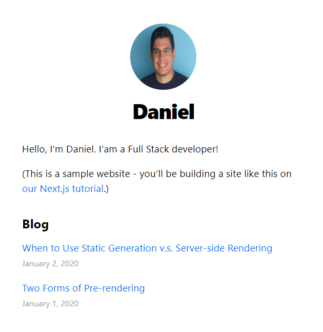
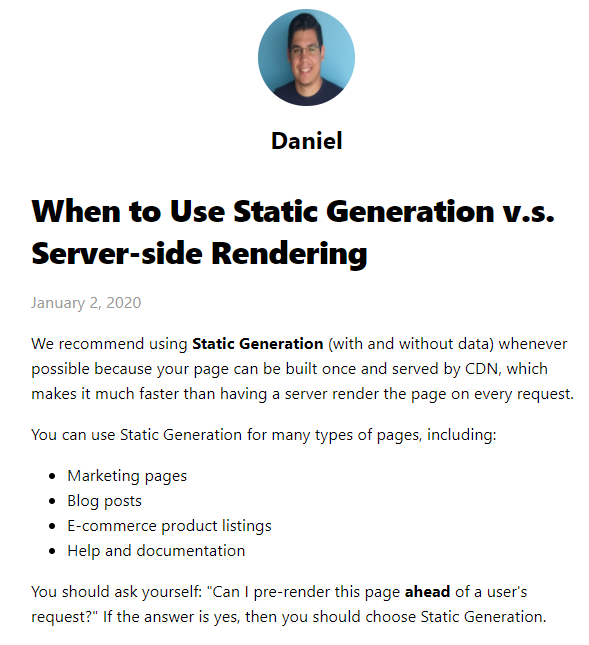
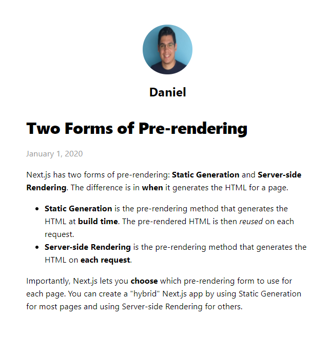

# Blog

This is a tutorial for [Learn Next.js](https://nextjs.org/learn).

## How to use

1. Clone this repository
2. Install the dependecies with the package manager of you preference. `npm install` or `yarn install`
3. Run the project in development mode: `npm run dev` or `yarn dev`

## Screenshots
1. Home page

2. Post Pages (using dynamic routes)

